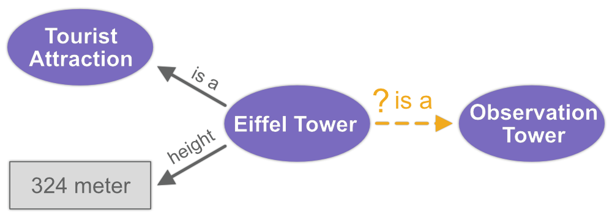

# LiteralE

Evaluation of Link Prediction Models that incorporate numerical literals. 

<p align="center">

</p>

This repository contains the source code, datasets, training result logs, and visualization Jupyter Notebooks. 

### Credits

This project is constructed upon the foundation laid by Agustinus Kristiadi's codebase 
available at <https://github.com/SmartDataAnalytics/LiteralE>, which in turn relies on the ConvE implementation 
by Tim Dettmers, accessible at <https://github.com/TimDettmers/ConvE>.


### ToDos


### Getting Started

**Note:** Python 3.6+ is required.

Note that we only support computation on GPU (CUDA). We have tested our code with Nvidia Titan Xp (12GB) and RTX 2080Ti (11GB). 6 or 8GB of memory should also be enough though we couldn't test them.

1. Install PyTorch. We have verified that version 1.2.0 works.
2. Install other requirements: `pip install -r requirements.txt`
3. Run `chmod +x preprocess.sh && ./preprocess.sh`
4. Install spacy model: `python -m spacy download en && python -m spacy download en_core_web_md`
5. Preprocess datasets (do these steps for each dataset in `{FB15k, FB15k-237, YAGO3-10}`):
    1. `python main_literal.py dataset {FB15k, FB15k-237, YAGO3-10} epochs 0 process True`
    2. Numerical literals: `python preprocess_num_lit.py --dataset {FB15k, FB15k-237, YAGO3-10}`
    3. Text literals: `python preprocess_txt_lit.py --dataset {FB15k, FB15k-237, YAGO3-10}`


### Reproducing Paper's Experiments

For DistMult+LiteralE and ComplEx+LiteralE:
```
python main_literal.py dataset {FB15k, FB15k-237, YAGO3-10} model {DistMult, ComplEx} input_drop 0.2 embedding_dim 100 batch_size 128 epochs 100 lr 0.001 process True
```

For ConvE+LiteralE:
```
python main_literal.py dataset {FB15k, FB15k-237, YAGO3-10} model ConvE input_drop 0.2 hidden_drop 0.3 feat_drop 0.2 embedding_dim 200 batch_size 128 epochs 100 lr 0.001 process True
```

For DistMult+LiteralE with numerical and textual literals:
```
python main_literal.py dataset {FB15k, FB15k-237, YAGO3-10} model DistMult_text input_drop 0.2 embedding_dim 100 batch_size 128 epochs 100 lr 0.001 process True
```

NB: For base models, replace `main_literal.py` with `main.py`.


### Visualizing the Results

To visualize the results, you can use the Jupyter Notebooks in the `evaluation_notebooks` directory.
* `evaluation_notebooks/evaluate_ablations.ipynb` - Plot results and creates Latex tables for all ablation experiments.
* `evaluation_notebooks/evaluate_synthetic.ipynb` - Implements the Acc metric, plots the results, creates Latex tables for the experiments around the semi-synthetic dataset.

In the Notebooks it is specified which result files are needed. We provide the result files of our experiments in the `results` and `saved_models` directory.
